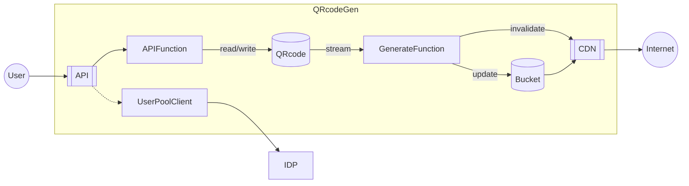

# qrcodegen

# Structure

## Diagram

## Table: QRcodeTable
### Schema
|AttrName |AttrType|Key  |
|---------|--------|-----|
|Key      |S       |Hash |
|UserId   |S       |     |
|State    |S       |     |
|Payload  |S       |     |
|Timestamp|N       |     |

### Attribute
* **Key**: Randomized string. S3 object key. Not reused.
* **UserId**: User ID generated by IDP
* **State**: AVAILABLE|DELETED
* **Payload**: Contents

### Index: UserIndex
|AttrName |Key  |
|---------|-----|
|UserId   |Hash |
|Timestamp|Range|
